# DYC 设计流程说明

这份说明记录 DYC 从算法选型到实车集成的设计路线。重点不在罗列代码，而是讲清楚为什么这样设计、目前做到哪一步、后面怎么继续落地，方便后续写论文、做答辩和交接工程实现。

## 1. 总体设计思路

本项目的 DYC 设计不是直接从代码开始，而是沿着“算法选型 -> 仿真验证 -> 驾驶员在环 -> 嵌入式移植 -> 实车集成”的路线逐步推进。

整体流程如下：

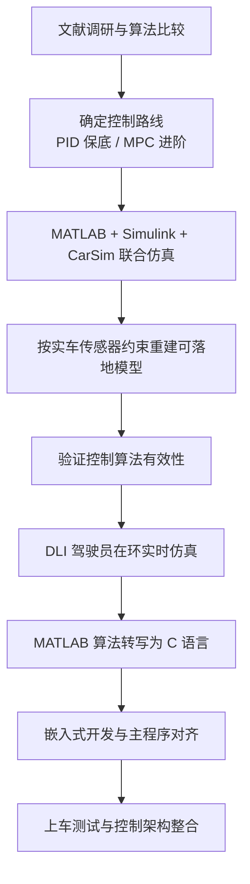

## 2. 文献调研与算法选型

设计工作的第一步，是通过查阅论文和已有研究，了解不同横摆稳定性控制算法的优缺点。

在这一阶段，重点不是追求“最复杂的算法”，而是先明确什么算法适合当前项目的工程条件、答辩需求和实车开发难度。

可以把这一阶段的决策过程理解为下面这张路线选择图：

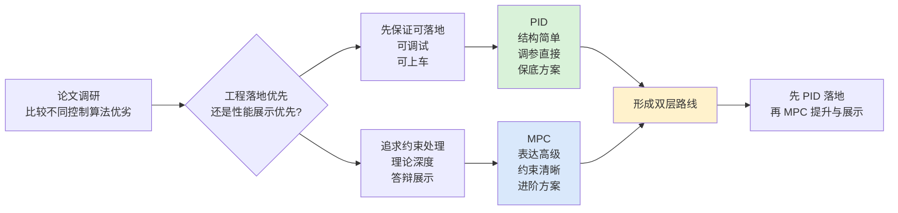

最终形成了两层控制路线：

- `PID` 作为保底算法。
  原因是结构简单、易于调参、工程实现直接，适合作为最先落地、最容易上车验证的方案。
- `MPC` 作为进阶算法和答辩展示算法。
  原因是 MPC 在理论表达、约束处理和高级控制效果上更有优势，更适合用于论文深度和答辩展示，但工程实现复杂度明显更高。

因此，本项目的算法策略不是“PID 和 MPC 二选一”，而是：

- 先用 PID 保证系统具备可运行、可验证、可上车的基本能力。
- 再用 MPC 作为性能提升和学术展示的上层方案。

## 3. 联合仿真阶段

在确定算法路线之后，下一步是用 MATLAB/Simulink 搭建控制算法模型，并与整车模型进行联合仿真，验证控制逻辑是否成立。

这一阶段的正确工作链，不是“CarSim 给什么就用什么”，而是下面这种受实车约束的闭环：

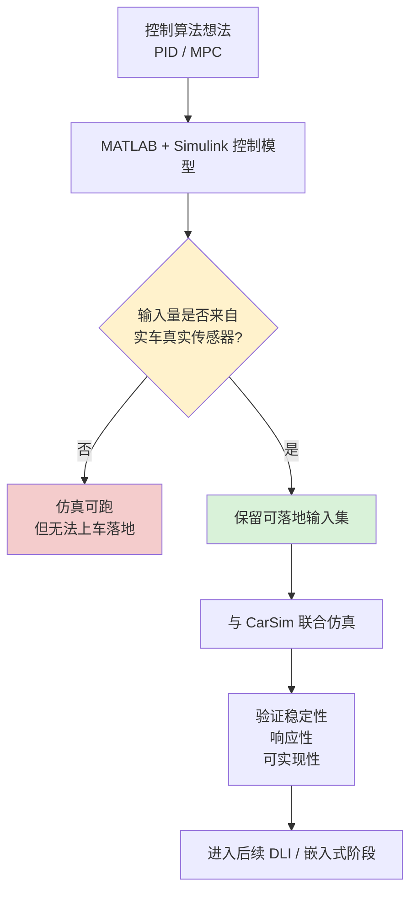

如果从平台结构来表示，`CarSim + Simulink` 联合仿真更接近下面这种关系：

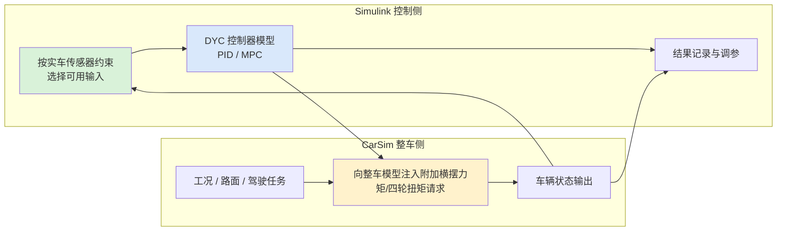

这一阶段的核心目的有两个：

1. 在不直接上车的前提下，先验证控制逻辑是否成立。
2. 提前发现状态量、控制量和模型参数之间是否存在明显问题。

但是这里有一个非常关键的原则，必须单独强调：

> 不能只看 CarSim 能输出什么遥测数据，而要严格看实车上到底实际有哪些传感器。

这条原则可以再压缩成一张“错误路径 vs 正确路径”对照图：

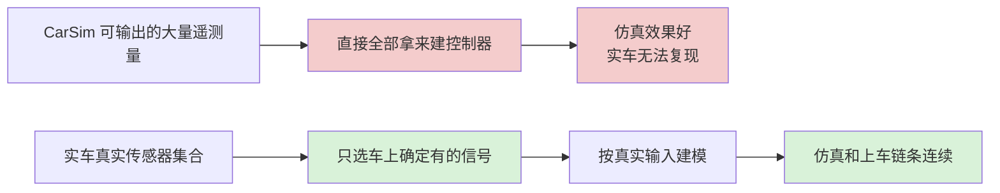

也就是说，在联合仿真阶段，模型输入不能完全按照 CarSim 的“理想可观测量”来设计，而必须尽量约束为实车真正能够提供的量，例如：

- 实车是否有横摆角速度传感器
- 实车是否有纵向/侧向加速度传感器
- 实车是否能可靠获得车速
- 实车是否能获得方向盘转角或前轮转角
- 实车是否能获得轮速、油门、扭矩请求等信号

如果仿真阶段使用了实车根本没有的状态量，那么即使仿真结果再好，后续也无法平滑落地到嵌入式和实车。

因此，这一阶段的正确思路应该是：

- 先确认实车传感器集合；
- 再按照这些真实可用信号搭建 Simulink 控制输入；
- 最后再验证控制算法效果。

这样做的意义，是保证后续“从仿真到上车”的技术链条是连续的，而不是仿真和实车完全脱节。

## 4. DLI 驾驶员在环仿真

在完成基础联合仿真之后，下一阶段是 DLI，即驾驶员在环仿真。

它和前一阶段的关系，可以直接理解成下面这个升级过程：

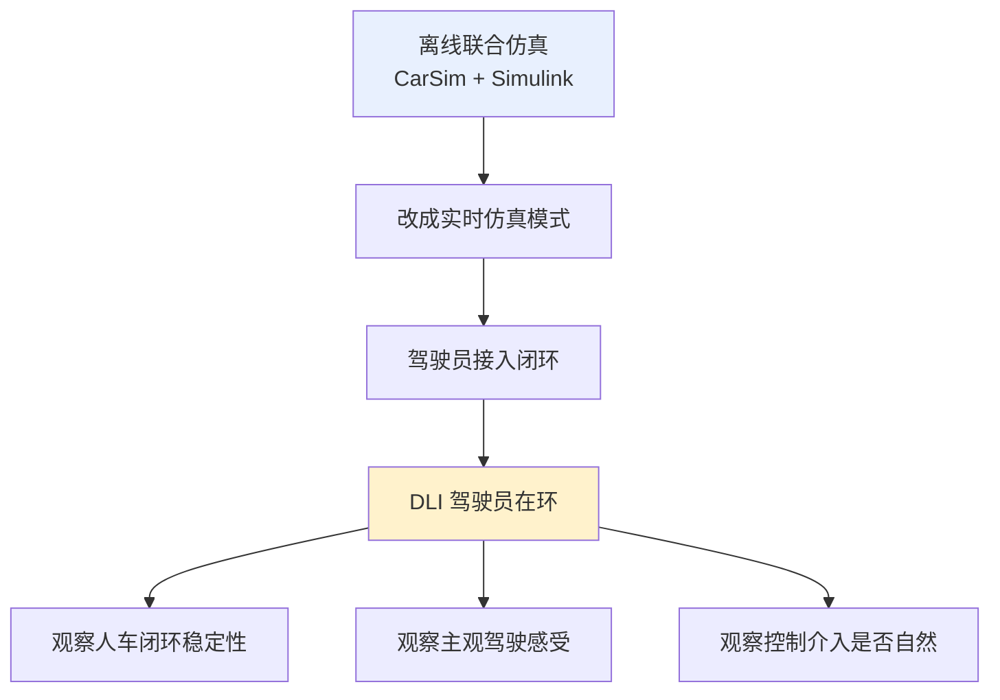

如果单独把 DLI 的闭环结构展开，可以表示成下面这样：

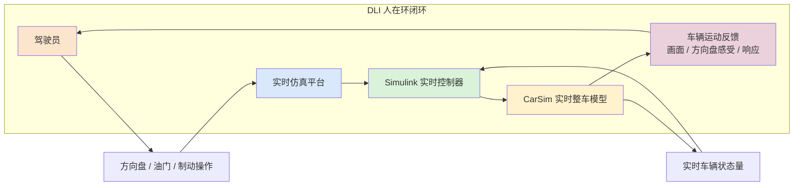

这一阶段的基本思路并不复杂，本质上就是把原来的 CarSim 联合 Simulink 仿真，进一步改为实时仿真模式，使驾驶员可以直接参与驾驶，从而更接近真实人车闭环。

它的意义在于：

- 不再只是看离线仿真曲线；
- 而是开始观察“人在控制回路中”时系统是否稳定、响应是否自然、控制是否容易感知；
- 这对后续实车测试和答辩展示都很重要。

但目前这一阶段还没有做得很好，主要原因在于：

- DLI 对模型实时性要求高；
- DLI 对整车模型精度要求高；
- DLI 对控制器与车辆模型的耦合一致性要求也更高。

这三个限制项之间的关系，可以看成一个“同时卡脖子”的约束三角：

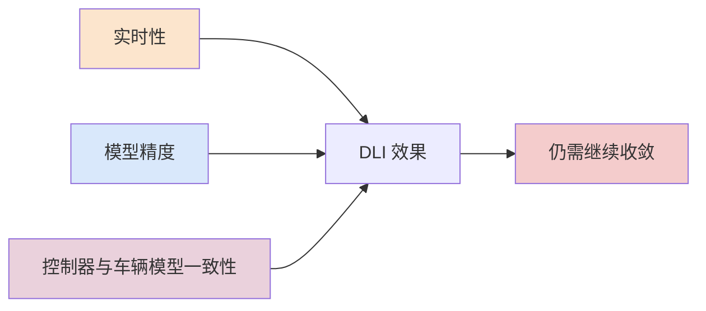

普通离线联合仿真能跑通，不代表实时驾驶员在环也能自然、稳定地工作。
这一阶段的主要瓶颈在模型精度、实时性和接口一致性，而不是控制路线本身。

## 5. MATLAB 到 C 语言的转写

完成仿真验证后，需要把 MATLAB/Simulink 中验证过的控制算法转写为 C 语言，进入嵌入式开发阶段。

这一阶段的工程路径如下：

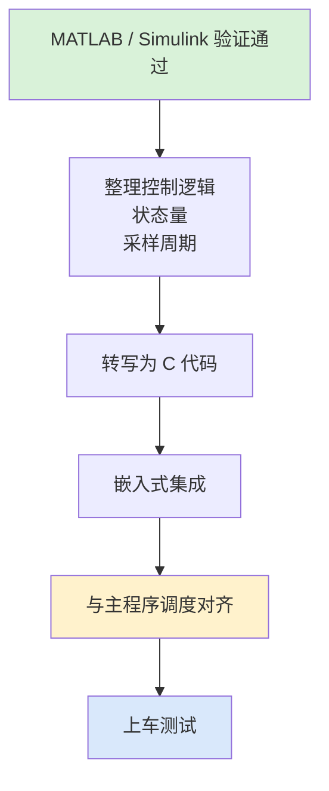

这一步是项目从“理论验证”走向“工程实现”的关键转折点。

这里最容易出问题的是采样周期、主程序调度和扭矩写入时机。

### 5.1 仿真频率与实际频率对齐

MATLAB/Simulink 里控制器的采样周期、积分步长和求解器设置，必须尽量和实际嵌入式控制周期对齐。

如果仿真里是一个频率，代码上车后又是另一个频率，那么以下内容都会被影响：

- PID 参数含义
- 离散化结果
- 扭矩变化率限制
- 滤波效果
- 控制器稳定性

因此，控制器从 MATLAB 转写到 C 时，不能只翻译公式，还必须同步检查采样周期是否一致。

这个问题本质上是下面这条链路是否一致：

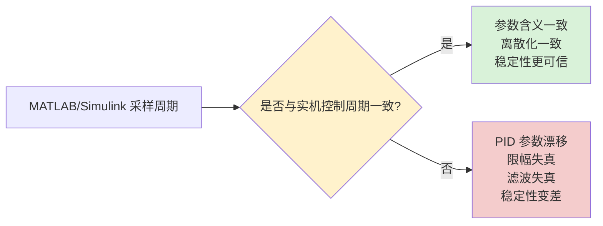

### 5.2 与主程序调度对齐

完成嵌入式开发并准备上车时，必须注意 DYC 控制周期要和主程序实际调度周期严格对齐。

这里的“对齐”不只是调用一次那么简单，而是要确保：

- DYC 的输入刷新节奏和主程序一致；
- DYC 的计算节奏和主程序定时调度一致；
- DYC 的输出扭矩写入时机与主程序整车扭矩逻辑一致；
- 不能出现信号更新、控制计算、扭矩发送三者脱节的情况。

否则就可能在仿真中有效、上车后失效。

主程序对齐问题可以抽象成下面这个同步链：

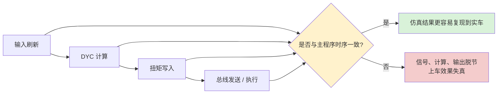

## 6. 实车集成时的两种架构思路

在 DYC 上车集成时，主要有两种设计思路。

先看两种架构的总对比：

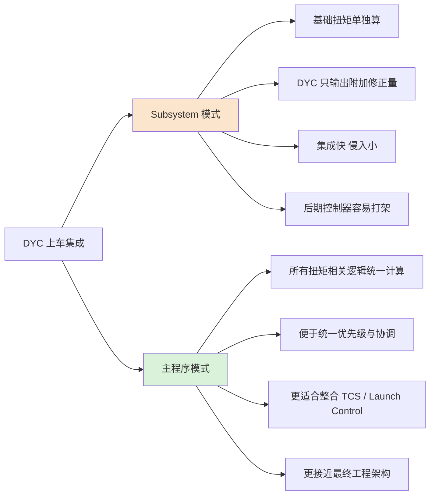

### 6.1 Subsystem 模式

第一种思路，是把 DYC 作为一个附加子系统来设计。

这种模式下，可以把主程序原本的油门到扭矩映射作为基础输出，再由 DYC 算法提供一个附加扭矩修正量：

- 基础扭矩由主程序原有逻辑生成；
- DYC 输出的是附加值；
- 这个附加值可以为正，也可以为负；
- 最终总扭矩 = 基础扭矩 + DYC 修正扭矩。

这种模式的优点是：

- 容易在现有系统上叠加；
- 对原有主程序侵入相对较小；
- 适合快速插入验证。

Subsystem 模式可以直接理解成：

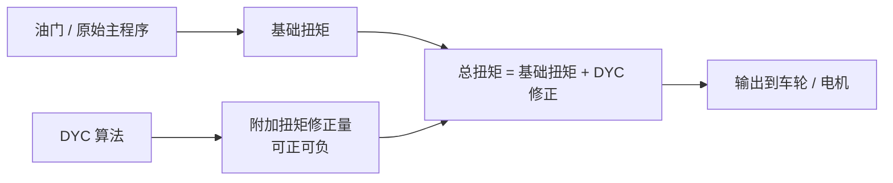

但它的缺点也很明显：

- 扭矩逻辑被拆散；
- 不利于统一管理各类控制器；
- 当系统里还要加入 TCS、Launch Control 等功能时，多个模块之间容易相互打架。

### 6.2 主程序模式

第二种思路，是把 DYC 放到主程序扭矩总逻辑中统一设计，也就是把所有与扭矩相关的计算全部集中起来。

在这种模式下：

- 油门请求
- 驱动请求
- DYC 横摆稳定控制
- TCS
- Launch Control
- 其他纵向/横向耦合控制

都在一个统一的主扭矩框架中进行协调。

主程序模式则更像一个统一扭矩调度中心：

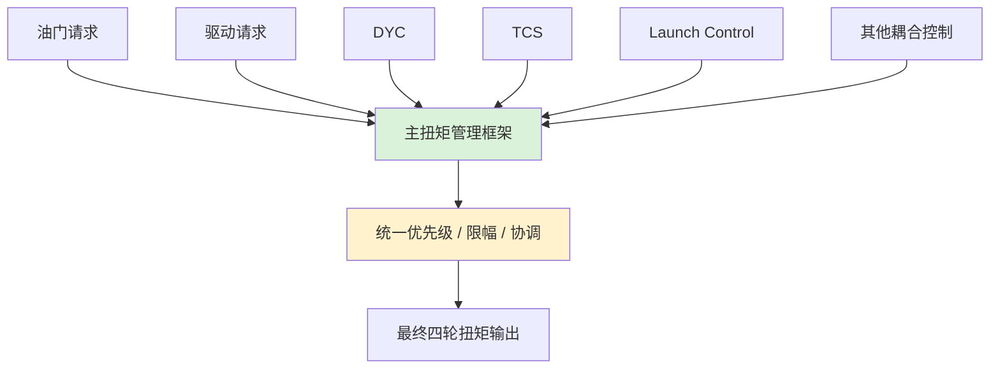

从长期维护和功能扩展看，主程序模式更合适：

1. 所有扭矩计算放在一起，逻辑更统一。
2. 多种控制功能之间更容易做优先级和协调设计。
3. 后续扩展 TCS、Launch Control 等功能时，系统结构更清晰，也更工程化。

也就是说，从长期架构看：

- `Subsystem 模式` 更像快速叠加方案；
- `主程序模式` 更像最终工程方案。

## 7. 当前设计路线的核心判断

目前的 DYC 设计路线可以压缩成几条判断：

路线图如下：

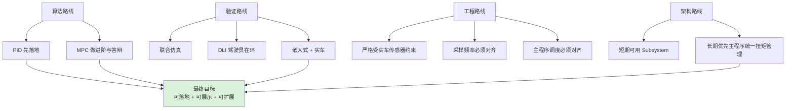

### 7.1 算法层面

- PID 负责保底和快速落地；
- MPC 负责进阶性能和论文/答辩展示。

### 7.2 验证层面

- 先做 MATLAB + Simulink + CarSim 联合仿真；
- 再推进 DLI 驾驶员在环仿真；
- 最终转向嵌入式和实车验证。

### 7.3 工程层面

- 仿真模型必须严格参照实车真实传感器；
- MATLAB 转 C 时必须对齐采样频率；
- 上车后必须和主程序调度、扭矩链路对齐。

### 7.4 架构层面

- 短期可以考虑附加子系统方案；
- 长期最优方案仍然是主程序统一扭矩管理方案。

## 8. 适合论文或答辩时的表达方式

用于论文、汇报或答辩时，可以这样概括：

> 本项目首先通过文献调研比较不同横摆稳定性控制算法，确定 PID 保底、MPC 进阶的双层路线。随后在 MATLAB/Simulink 与 CarSim 平台上开展联合仿真，并在建模阶段约束输入信号必须来自实车可获得的传感器，而不是直接使用仿真平台能够输出的全部理想遥测量。在此基础上，项目继续面向 DLI 驾驶员在环实时仿真、C 代码转写、嵌入式集成和实车测试推进。工程集成上，短期可以采用 DYC 附加子系统实现扭矩修正；长期更适合在主程序中统一管理 DYC、TCS、Launch Control 等扭矩相关控制，减少控制器之间的冲突。

## 9. 后续可继续补充的内容

后续可以继续补充：

1. 论文调研中比较过哪些控制算法，各自优缺点是什么。
2. MATLAB/Simulink 联合仿真的具体模型结构。
3. 当前实车实际具备哪些传感器，以及哪些信号最关键。
4. DLI 目前做得不好的具体原因，是模型精度、实时性还是接口问题。
5. MATLAB 转 C 时已经遇到的实际 bug 和对齐问题。
6. 主程序模式下，DYC/TCS/Launch Control 应该如何统一调度。
