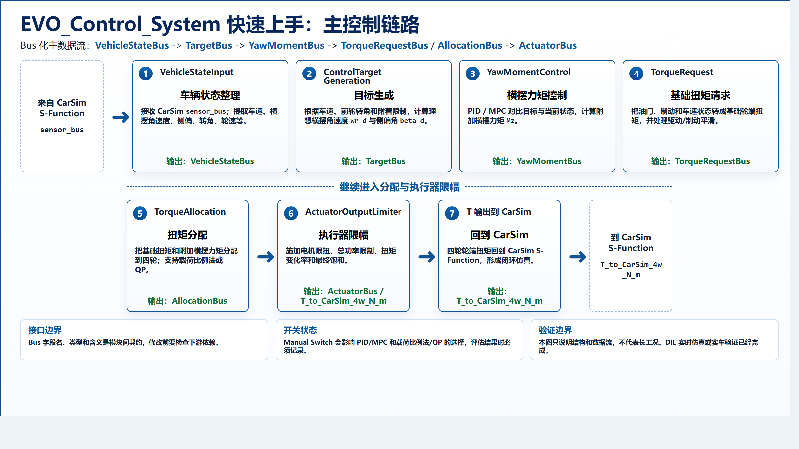
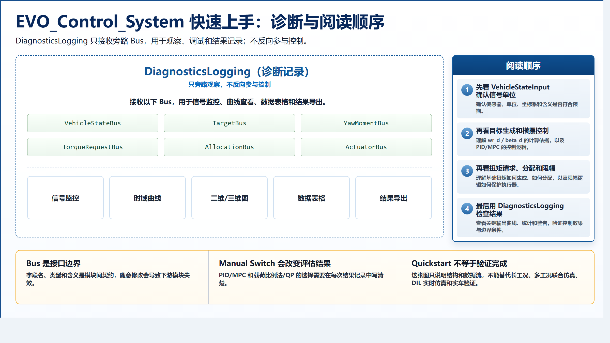
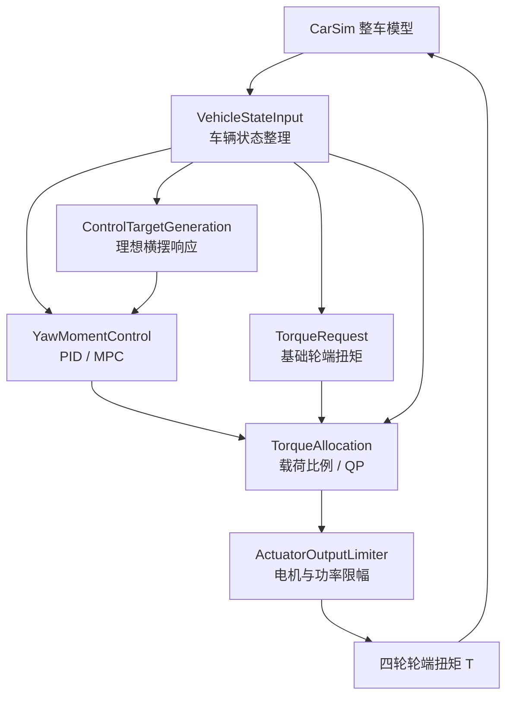
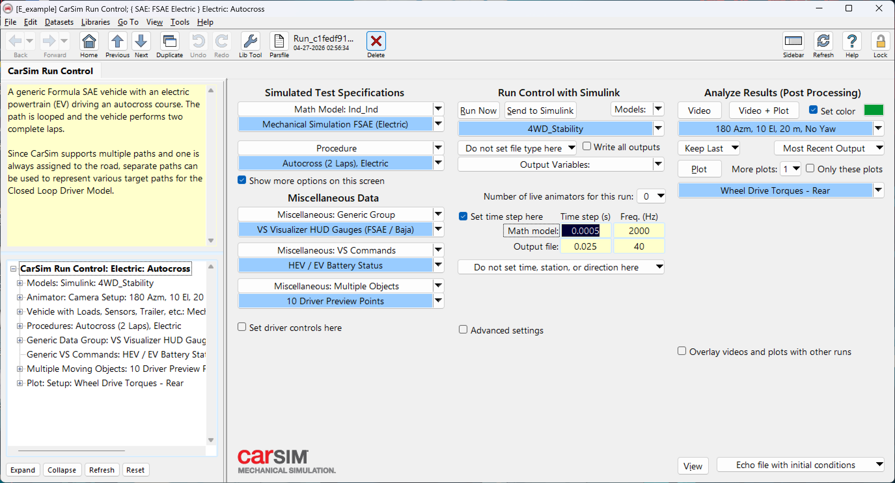
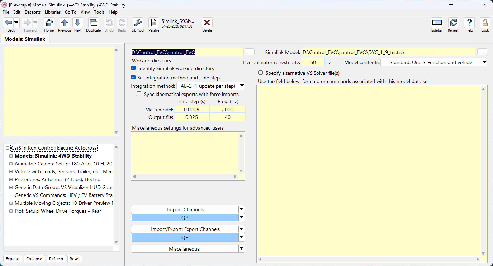

# Control_EVO

面向 FSAE 的开源电控算法验证平台，当前重点是四轮独立驱动场景下的直接横摆力矩控制（Direct Yaw Moment Control, DYC）。项目使用 MATLAB/Simulink 搭建控制算法，并通过 CarSim + Simulink 闭环联合仿真验证车辆稳定性控制链路。

## 开源初衷

这份开源算法，是我 FSAE 生涯的最后一舞。它最初是写给学弟们的：希望后来的人不必从零开始，也不必把一代代踩过的坑重新踩一遍。可我想了很久，单靠一支车队维护的算法体系终究是有限的，也可能随着人员更替慢慢失传。起初我也顾虑，把原本属于车队的积累公开给所有车队，会不会对不起自己的学弟们；但现在我更相信，真正能让一套方法留下来的，不是把它锁在某个文件夹里，而是让更多人使用、质疑、修正和继续建设。

只有竞争才会变强，只有持续被使用才不会失传。因此，这次开源不仅是给我的学弟们，也希望能为 FSAE CN 赛区的算法进步尽一点力。我也在这里真诚呼吁各位前辈、各位工程师朋友、各位师弟师妹们一起参与，持续完善 CN 赛区的算法设计、仿真验证和测试体系。一枝独秀不是春，百花齐放春满园。来探索吧，来为 CN FSAE 的算法生态添砖加瓦。

这个仓库主要放这些内容：

- DYC 横摆稳定性控制：PID 保底方案 + MPC 进阶方案。
- 四轮轮端扭矩分配：载荷比例法 + QP 优化分配。
- 轮胎控制边界：Pacejka/Hoosier 查表，用于扭矩分配限幅。
- 执行器约束：电机限扭、总功率限制、扭矩变化率约束。
- CarSim + Simulink 闭环：CarSim 负责车辆动力学，Simulink 负责控制器输出四轮轮端扭矩。
- Agent 辅助工程：仓库内保留面向自动化协作的技术文档和可验证入口，便于持续进行公式核对、模型结构整理、测试补充和工程说明维护。

更完整的公式和控制链路说明见：[docs/control_evo_technical_design.md](docs/control_evo_technical_design.md)。

> 先看给项目成员和新同学准备的内容；文末单独放了 Agent 工作流说明，普通使用者可以先跳过。

如果需要拆开阅读，下面两张图分别说明主控制链路和诊断旁路：





## 开发版本说明

本项目使用 MATLAB R2026a / Simulink R2026a 开发。项目会持续迭代模型结构、控制分配、测试脚本和工具链，参与开发时优先使用 R2026a 或更新版本。

如果必须使用旧版本 MATLAB 打开模型，请避免直接保存主模型文件，先在分支或备份模型上验证兼容性，防止 `.slx` 文件因版本回存造成结构、库链接或块参数差异。

## 系统架构



主模型为 `control_EVO/DYC_1_9_test.slx`。顶层闭环关系为：

```text
CarSim S-Function.y1 -> EVO_Control_System.sensor
EVO_Control_System.T -> CarSim S-Function.u1
```

## 项目结构

```text
.
├── DYC_设计流程说明.md
│   └── 面向论文、答辩和工程路线说明的 DYC 设计流程
├── README.md
│   └── GitHub 仓库主页说明
├── carsim_models/
│   └── E_example.zip
│       └── CarSim 示例模型压缩包
├── docs/
│   └── control_evo_technical_design.md
│       └── 完整技术设计文档，包含公式、架构和算法说明
├── control_EVO/
│   ├── DYC_1_9_test.slx
│   │   └── 当前主 Simulink + CarSim 联合仿真模型
│   ├── simfile.template.sim
│   │   └── CarSim `.sim` 文件模板，实际运行文件由本机 CarSim 生成
│   ├── DYC_vehicle_params.m
│   │   └── 统一车辆参数入口
│   ├── DYC_base_motor_torque.m
│   │   └── 基础轮端扭矩请求计算
│   ├── DYC_torque_request_manager.m
│   │   └── 扭矩请求与制动平滑逻辑
│   ├── DYC_simple_load_transfer_distribution.m
│   │   └── 载荷比例法扭矩分配
│   ├── QP_TorqueDistribution.m
│   │   └── QP 四轮扭矩分配
│   ├── DYC_tire_lookup_config.m
│   │   └── 控制侧轮胎查表配置，默认 mode = 'pacejka'
│   ├── DYC_motor_wheel_torque_limit.m
│   │   └── 电机转速限扭
│   ├── DYC_apply_motor_limits.m
│   │   └── 电机限扭、总功率限制和最终输出限幅
│   ├── tire_modeling/
│   │   └── Hoosier/Pacejka 控制查表生成、测试和输出
│   └── round9_pacejka_engineering_package/
│       └── TTC Round9 Pacejka 工程包和示例
└── tools/
    └── 模型整理、轮胎模型和局部验证脚本
```

第三方论文、CAJ、PDF 和个人阅读笔记不随开源仓库分发；如需复现文献阅读环境，请按公开来源重新获取。

## Quickstart

### 1. 准备环境

本机需要准备：

- MATLAB R2026a / Simulink R2026a 或更新版本。旧版本可能能读取部分脚本，但不要直接保存主模型。
- CarSim 2024 或兼容版本，并具备有效许可证。
- CarSim 的 MATLAB solver/S-Function 路径可被 MATLAB 解析。

仓库内的 `carsim_models/E_example.zip` 是示例 CarSim 模型包。CarSim 是商业软件，仓库不包含 CarSim 程序本体或许可证。

### 2. 克隆仓库

```powershell
git clone <your-repo-url>
cd Control_EVO
```

### 3. 从 CarSim 侧发送到 Simulink

常规流程从 CarSim 侧开始：

1. 将 `carsim_models/E_example.zip` 解压或导入到本机 CarSim 数据库。
2. 在 CarSim 中打开对应模型和仿真 Run。
3. 使用 CarSim 的 `Send to Simulink` 功能打开 Simulink 联合仿真模型。
4. 在 CarSim 拉起的 Simulink/MATLAB 会话中确认模型能看到 `CarSim S-Function`。

在 CarSim Run Control 页，先进入 `Models: Simulink: 4WD_Stability` 配置页，再点击 `Send to Simulink`：



在 `Models: Simulink` 配置页，确认工作目录指向本仓库，并把 `Simulink Model` 指向 `control_EVO/DYC_1_9_test.slx`：



这条路径最接近实际联合仿真，因为 CarSim 会把当前数据库、Run 配置和 S-Function 上下文带到 Simulink 侧。

### 4. 在 MATLAB 会话中加入项目路径

CarSim 打开 Simulink 后，在同一个 MATLAB 会话中加入本仓库控制代码路径：

```matlab
repo = '<本地 Control_EVO 仓库路径>';

addpath(fullfile(repo, 'control_EVO'));
addpath(fullfile(repo, 'control_EVO', 'tire_modeling'));
addpath(fullfile(repo, 'control_EVO', 'round9_pacejka_engineering_package', 'matlab'));
```

如需手动补 CarSim solver 路径，按本机安装位置执行：

```matlab
addpath('<CarSim 安装目录>\Programs\solvers\Matlab');

which Solver_SF
which vs_sf
```

如果 `which Solver_SF` 或 `which vs_sf` 为空，说明 CarSim 的 Simulink S-Function 路径还没加好，模型更新或仿真会失败。

### 5. 确认 Simulink 闭环模型

主模型应为 `control_EVO/DYC_1_9_test.slx`。打开后应能看到 CarSim S-Function 与 `EVO_Control_System` 控制系统闭环连接：

```text
CarSim S-Function.y1 -> EVO_Control_System.sensor
EVO_Control_System.T -> CarSim S-Function.u1
```

`EVO_Control_System` 内部按 Bus 化主控制链路组织。主链路、诊断旁路和阅读顺序见文档开头的两张 Quickstart 图。

### 6. 从 Simulink 运行联合仿真

优先在 CarSim 发送过来的 Simulink 模型窗口中直接运行仿真，这样最容易保持当前 CarSim Run 与 Simulink S-Function 上下文一致。

运行结果需要结合 CarSim 输出文件和 Simulink 记录信号判断，不应仅凭模型能启动就认为完成比赛级验证。

### 可选：脚本化快速验证路径

下面这条路径适合自动化检查、Agent 排查或无 GUI 批处理；普通使用者优先走 CarSim `Send to Simulink`。

```matlab
mdl = 'DYC_1_9_test';
open_system(fullfile(repo, 'control_EVO', [mdl '.slx']));

in = Simulink.SimulationInput(mdl);
in = in.setModelParameter('StopTime', '10');
out = sim(in);
```

如果 CarSim 模型数据库、solver 路径和许可证都正常，脚本化路径也应能由 Simulink 调用 CarSim S-Function 完成有限时长闭环运行。

## 常用入口

### 查看统一车辆参数

```matlab
veh = DYC_vehicle_params()
```

核心参数包括 `m = 300 kg`、`Iz = 89.99 kg*m^2`、`lf = 0.77 m`、`lr = 0.77 m`、`r = 0.260 m`、`tf = 1.21 m`、`tr = 1.20 m`。

### 切换控制侧轮胎查表

默认配置位于 `control_EVO/DYC_tire_lookup_config.m`：

```matlab
cfg.mode = 'pacejka';
cfg.allowEnvironmentOverride = false;
```

如需切换到 Hoosier 直接查表，可将 `cfg.mode` 改为 `'hoosier'`。这些查表用于控制限幅和扭矩分配边界，不替代 CarSim 求解器内部轮胎模型。

### 重新生成 Pacejka 控制查表

```matlab
model = build_pacejka_control_lookup(repo);
```

输出文件默认写入 `control_EVO/tire_modeling/outputs/`。

### 运行轮胎和分配相关测试

```matlab
results = runtests('control_EVO/tire_modeling/tests');
table(results)
```

## 验证边界

- 常规交互工作流应从 CarSim 侧 `Send to Simulink` 开始；MATLAB `sim(...)` 路径主要用于脚本化、自动化和 Agent 验证。
- 已知本地工作流可以通过 MATLAB/Simulink 调用 CarSim S-Function 做有限时长闭环仿真，但每次复现仍依赖本机 CarSim 路径、许可证、模型数据库和 solver 链接状态。
- `docs/control_evo_technical_design.md` 中的算法说明基于当前仓库文件、Simulink 静态读取结果和已确认项目状态整理，不新增额外仿真结论。
- CarSim 求解器内部轮胎模型与 Simulink 控制侧轮胎查表是两条不同链路：前者用于整车动力学求解，后者用于控制分配限幅。
- 项目后续还需要 DIL 实时仿真、代码生成/嵌入式移植和实车验证，不能把离线联合仿真等同于最终上车结论。

## 进一步阅读

- [完整技术设计文档](docs/control_evo_technical_design.md)
- [DYC 设计流程说明](DYC_设计流程说明.md)
- [轮胎控制查表说明](control_EVO/tire_modeling/README.md)
- [Round9 Pacejka 工程包说明](control_EVO/round9_pacejka_engineering_package/README.md)

## Agent 工作流

这一节给自动化助手和模型维护工具链使用。普通开发者只想打开项目、跑联合仿真或理解算法时，可以先看上面的内容。

本项目支持 Agent 参与辅助设计、排查和文档维护。适合交给 Agent 的工作包括公式核对、MATLAB 函数检查、测试补充、模型结构静态读取、README/技术文档维护和验证边界说明；涉及 CarSim GUI、长工况、DIL 或实车结论时，必须以实际运行证据为准。

### 推荐安装的 Agent 工具链

建议为 Agent 工作流安装并配置 MathWorks 官方工具链：

- [MATLAB Agentic Toolkit](https://github.com/matlab/matlab-agentic-toolkit)：用于让 Agent 调用 MATLAB，执行脚本、运行测试、检查 MATLAB 代码和读取工作区结果。
- [Simulink Agentic Toolkit](https://github.com/matlab/simulink-agentic-toolkit)：用于让 Agent 读取、查询和小范围编辑 Simulink/System Composer/Stateflow 模型。

安装后应按官方仓库说明完成 MATLAB 会话共享、MCP/Agent 连接和工具可用性验证。对本项目来说，最低可用标准不是“配置文件存在”，而是 Agent 能真实调用 MATLAB/Simulink 工具，例如读取已保存的 `.slx`、检查模型参数、运行 MATLAB 测试或执行有限时长仿真。

### CarSim Send to Simulink 使用经验

本项目的常规联合仿真入口应从 CarSim 侧 `Send to Simulink` 开始。实践经验是：CarSim 拉起的 Simulink/MATLAB 会话通常最可靠，因为它带有当前 CarSim 数据库、Run 配置、S-Function 上下文和 solver 链接关系。

Agent 协助时按这个顺序处理：

1. 先由使用者在 CarSim 中打开目标 Run，并执行 `Send to Simulink`。
2. 确认打开的是 CarSim 拉起的 Simulink 模型窗口，而不是另一个普通 MATLAB 会话里随手打开的 `.slx`。
3. 在该 MATLAB/Simulink 会话中加入本仓库 `control_EVO/`、`tire_modeling/` 等路径。
4. 静态核对 `CarSim S-Function` 是否可见，函数名是否为 `vs_sf`，以及闭环连接是否仍为 `CarSim S-Function.y1 -> EVO_Control_System.sensor`、`EVO_Control_System.T -> CarSim S-Function.u1`。
5. Agent 可以通过 Simulink Agentic Toolkit 读取结构、检查参数和做小范围修改；这代表模型层访问能力，不等于能稳定控制 CarSim GUI。
6. 如果要声明仿真成功，应实际运行有限 `StopTime` 或指定工况，并检查 CarSim/Simulink 输出；不能只凭模型能打开就写成验证通过。

Agent 进入仓库后按这个顺序建立上下文：

1. 如果本地存在私有协作规则文件，先读本地规则；这类文件通常包含机器路径、工具链配置和协作约定，不随公开仓库提交。
2. 再读本 `README.md`，理解普通用户的主入口是 CarSim 侧 `Send to Simulink`。
3. 读 `docs/control_evo_technical_design.md`，掌握 DYC 车辆动力学公式、PID/MPC、QP 分配、轮胎查表和电机限扭链路。
4. 读 `DYC_设计流程说明.md`，理解项目从联合仿真到 DIL、嵌入式和实车集成的长期路线。

常用文件入口：

```text
control_EVO/DYC_1_9_test.slx                 主 Simulink + CarSim 联合仿真模型
control_EVO/DYC_vehicle_params.m             统一车辆参数
control_EVO/QP_TorqueDistribution.m          QP 四轮扭矩分配
control_EVO/DYC_simple_load_transfer_distribution.m  载荷比例法分配
control_EVO/DYC_tire_lookup_config.m         轮胎查表模式配置
control_EVO/tire_modeling/tests/             轮胎查表与分配相关测试
docs/control_evo_technical_design.md         完整技术设计文档
```

只读起步检查：

```powershell
git status --short --untracked-files=all
rg --files
```

MATLAB 侧轻量检查：

```matlab
repo = '<本地 Control_EVO 仓库路径>';
addpath(fullfile(repo, 'control_EVO'));
addpath(fullfile(repo, 'control_EVO', 'tire_modeling'));

veh = DYC_vehicle_params()
results = runtests(fullfile(repo, 'control_EVO', 'tire_modeling', 'tests'));
table(results)
```

Agent 做模型级工作时应优先静态读取和参数核对；如需改 `.slx`，先备份、再小范围修改、再做模型读取或更新验证。普通交互仿真仍以 CarSim `Send to Simulink` 拉起的会话为主，脚本化 `sim(...)` 只作为自动化验证路径。
