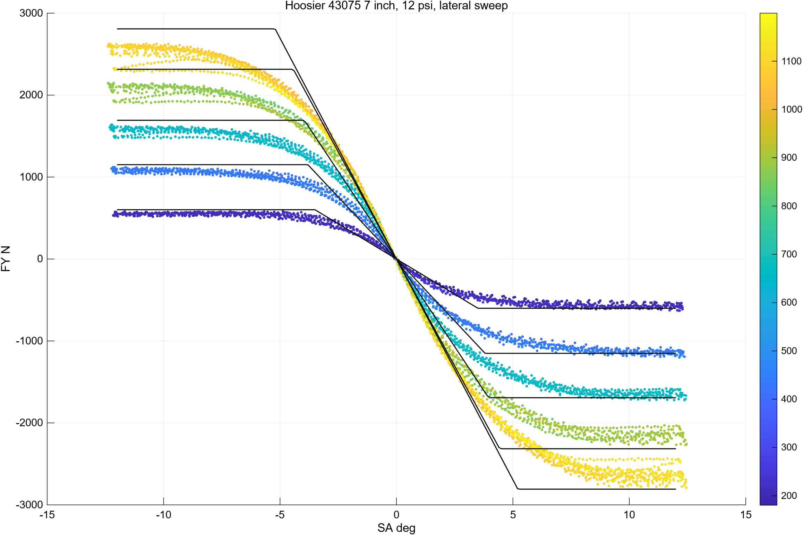
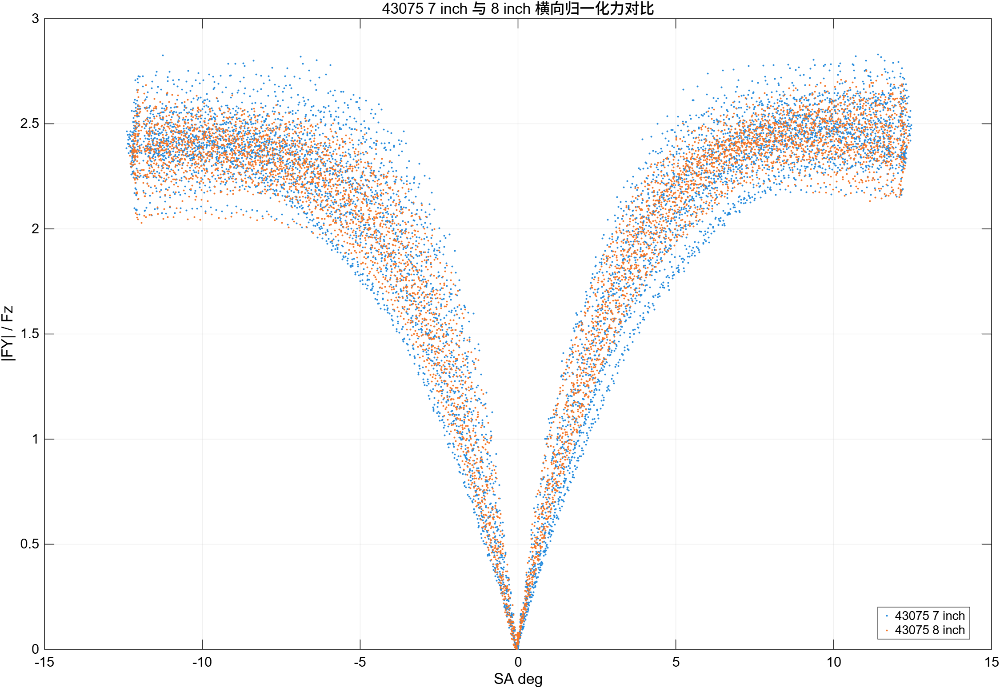
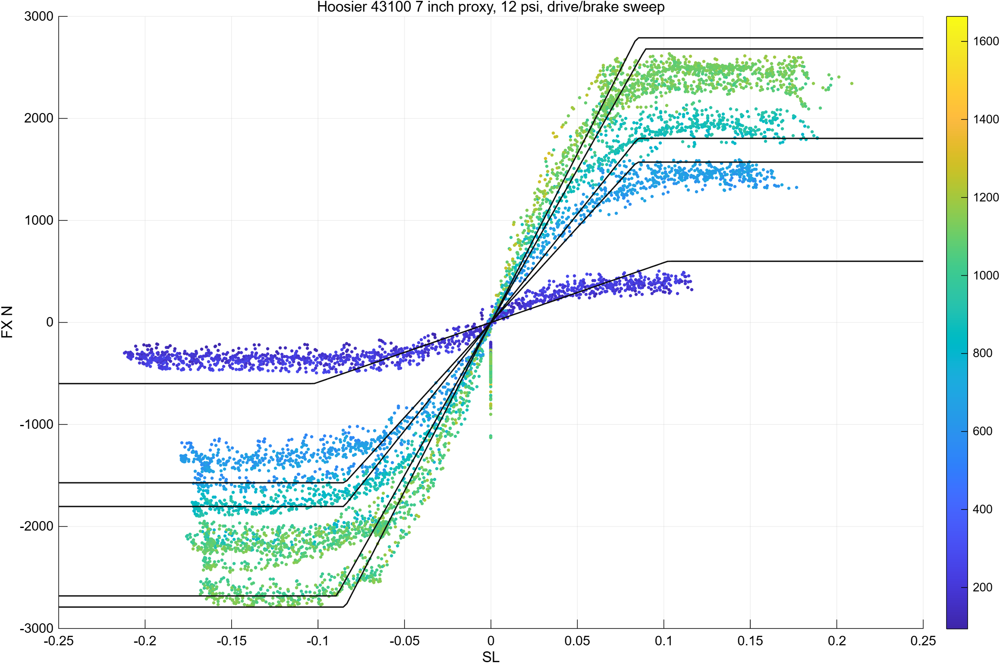
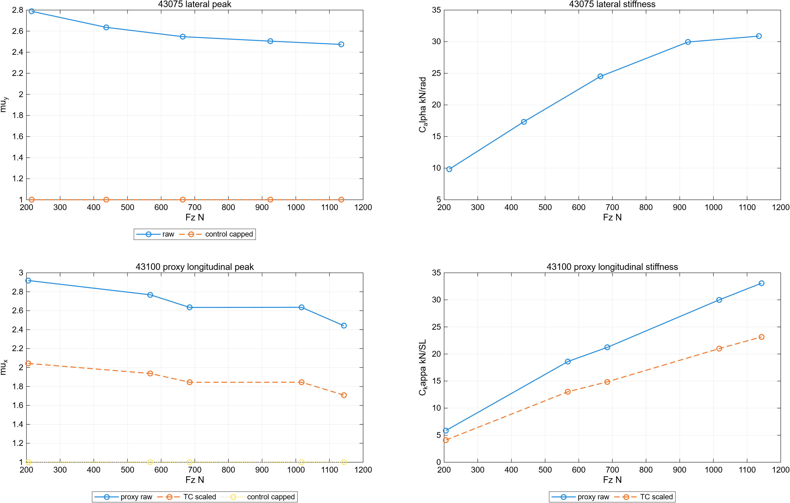
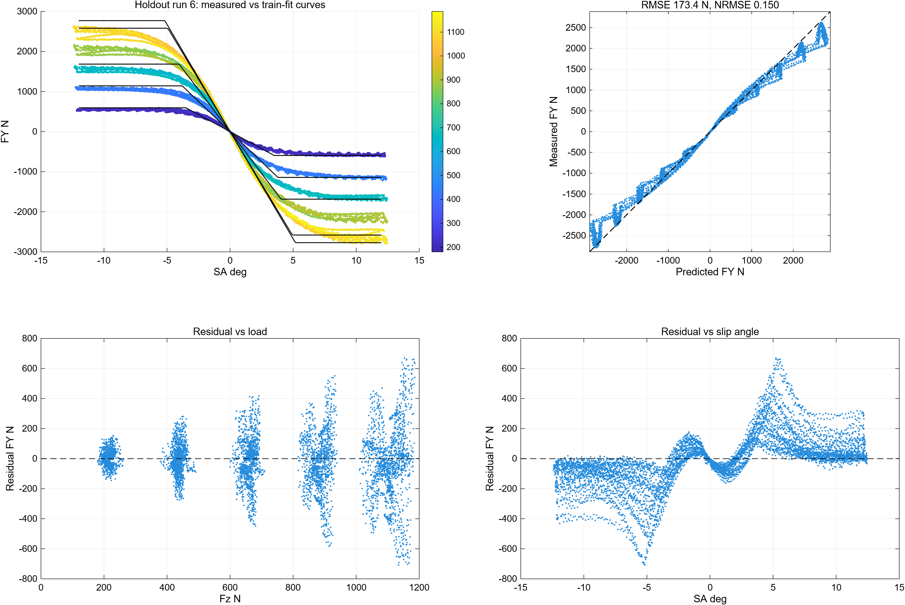
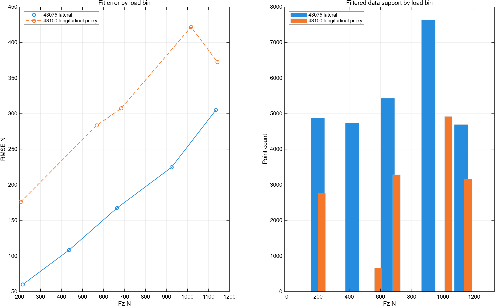

# Hoosier 43075 控制用轮胎模型分析报告

## 1. 结论摘要

Hoosier 43075 的第一阶段控制用轮胎模型已经整理完成。这一版适合用于四电机扭矩分配和 TC 的前期边界设计：模型不追求完整 Pacejka 参数辨识，而是从 TTC Round9 数据中提取稳定、可验证、便于上车限幅的查表量。

这套查表可以支持以下用途：

- 横向附着能力查表：`mu_y(Fz)`。
- 横偏刚度查表：`C_alpha(Fz)`。
- 纵向代理附着查表：`mu_x(Fz)`。
- 纵向滑移刚度代理查表：`C_kappa(Fz)`。
- 四轮剩余纵向力和扭矩边界：`Fx_limit`、`T_limit`。

需要明确的是：Round9 中没有 Hoosier 43075 的 Drive/Brake 数据，因此纵向模型不是 43075 本胎的直接辨识结果，而是使用 Hoosier 43100 7 inch 数据作为代理，再通过 `muScaleTc = 0.70` 和 `controlMuCeiling = 1.00` 做保守处理。这个选择适合 TC 第一版，不应表述为“43075 纵向模型已经完整辨识”。

## 2. 数据与假设

### 2.1 目标轮胎

- 轮胎：Hoosier 43075 16x7.5-10 R20。
- 轮辋：7 inch rim。
- 胎压：12 psi。
- 主要用途：FSAE 四电机扭矩分配、牵引力控制、摩擦圆/椭圆约束。

### 2.2 数据来源

数据来自使用者本地 TTC Round9 数据目录：

```text
<本地 TTC Round9 数据目录>
```

横向主数据使用：

```text
RunData_Cornering_Matlab_SI_Round9
runs 2, 4, 5, 6
```

纵向代理数据使用：

```text
RunData_DriveBrake_Matlab_SI_Round9
runs 71, 72, 73
```

### 2.3 数据过滤条件

模型构建时采用以下过滤：

- 胎压窗口：`12.00 +/- 0.35 psi`。
- 速度下限：`20.0 kph`。
- 倾角窗口：`|IA| <= 0.35 deg`。
- 载荷窗口：`60 N <= Fz <= 1800 N`。
- 横向数据额外限制：`|SA| <= 13 deg`。
- 纵向数据额外限制：`|SA| <= 0.35 deg`。

过滤后的有效数据量：

- 43075 横向有效点：`27377`。
- 43100 纵向代理有效点：`14906`。

## 3. 图件解读

### 3.1 横向 FY-SA 拟合



这张图展示 Hoosier 43075 在 7 inch 轮辋、12 psi 条件下的横向力随侧偏角变化关系。散点是原始 TTC 数据，黑色曲线是按不同垂向载荷分箱得到的控制用拟合曲线。

主要观察：

- 横向力随 `Fz` 增大而增大，数据分层清楚。
- 小侧偏角区间近似线性，可用于提取 `C_alpha(Fz)`。
- 大侧偏角区间出现饱和，适合提取峰值附着 `mu_y(Fz)`。
- 模型使用分段限幅线性形式，目标是控制限幅稳定，不是复现每个 sweep 的细节。

### 3.2 7 inch 与 8 inch 对比



这张图用于说明为什么当前模型锁定 7 inch 轮辋。7 inch 与 8 inch 的横向归一化力整体接近，但两者并不是完全相同的数据族。考虑到车辆实际轮辋假设为 7 inch，控制模型应优先使用 7 inch 数据。

该图的作用不是证明 8 inch 不可用，而是保留轮辋选择依据，避免后续把不同轮辋数据混合后造成模型解释困难。

### 3.3 纵向代理 FX-SL 拟合



这张图展示 Hoosier 43100 7 inch drive/brake 数据。由于 Round9 没有 43075 Drive/Brake 数据，当前 TC 纵向模型只能使用 43100 作为代理。

主要观察：

- 正负滑移方向均有明显饱和区。
- 小滑移区间可提取 `C_kappa(Fz)`。
- 原始纵向峰值摩擦较高，直接用于上车会偏激进。
- 因此控制接口默认采用 `muScaleTc = 0.70`，并最终用 `controlMuCeiling = 1.00` 封顶。

这意味着纵向模型的定位是“保守 TC 限幅代理”，不是最终轮胎纵向辨识结论。

### 3.4 控制用查表



这张图是对上车最重要的一张图。它展示：

- 43075 横向峰值 `mu_y(Fz)`。
- 43075 横偏刚度 `C_alpha(Fz)`。
- 43100 纵向代理峰值 `mu_x_proxy(Fz)`。
- TC 缩放后的纵向附着。
- 控制封顶后的实际输出边界。
- 纵向代理刚度 `C_kappa(Fz)` 与 TC 缩放值。

从控制角度看，`raw` 值主要用于理解轮胎能力，`control capped` 才是第一版上车约束应使用的值。当前 `controlMuCeiling = 1.00` 的意义是：在没有完成整车验证前，不让新查表方案比原固定 `Mu=1` 的约束更激进。

### 3.5 留一验证



留一验证使用 runs `[4 5]` 训练，用 run `6` 做 holdout。结果：

- holdout 点数：`18361`。
- RMSE：`173.390 N`。
- 归一化 RMSE：`0.150`。

从右上角的 measured-predicted 图可以看到整体趋势贴合较好，说明模型不是只贴合单次 sweep。残差图显示高载荷和较大侧偏角区域误差更明显，这符合低阶查表模型的预期：它适合做控制限幅，不适合替代高精度离线轮胎模型。

### 3.6 拟合质量与数据支撑



这张图用于快速判断模型可信度。左图是各载荷分箱 RMSE，右图是各分箱有效点数。

主要结论：

- 横向 43075 数据量充足，分箱支撑较好。
- 纵向代理数据在不同载荷分箱的数据量不均匀，部分区间误差更高。
- 因此纵向模型必须保持“代理 + 保守缩放”的解释，不应直接等同 43075 的真实纵向能力。

## 4. 模型输出

模型构建脚本：

```matlab
build_hoosier43075_model
```

输出文件：

```text
control_EVO/tire_modeling/outputs/hoosier43075_control_model.mat
control_EVO/tire_modeling/outputs/hoosier43075_fit_report.md
```

控制查询函数：

```matlab
out = lookup_hoosier43075_limits(Fz, FyUsed, alphaRad, kappa);
```

主要输出字段：

- `mu_x`：控制实际使用的纵向摩擦系数。
- `mu_y`：控制实际使用的横向摩擦系数。
- `C_alpha`：横偏刚度。
- `C_kappa`：纵向滑移刚度代理。
- `Fx_limit`：考虑横向已用力后的剩余纵向力上限。
- `Fy_limit`：横向力上限。
- `T_limit`：由 `Fx_limit * r` 得到的轮端扭矩上限。

## 5. 控制接口含义

查表函数的核心用途是给四电机扭矩分配提供每个轮胎的纵向可用力边界。典型用法是：

```matlab
FzWheel = [Fz_FL; Fz_FR; Fz_RL; Fz_RR];
FyUsedWheel = [Fy_FL; Fy_FR; Fy_RL; Fy_RR];

limit = lookup_hoosier43075_limits(FzWheel, FyUsedWheel);
TmaxWheel = limit.T_limit;
```

然后在 QP 扭矩分配中使用：

```text
-TmaxWheel <= T_wheel <= TmaxWheel
```

如果后续需要区分驱动和制动边界，可以在 lookup 层继续扩展 `T_drive_limit` 与 `T_brake_limit`，但第一阶段不建议复杂化。

## 6. 可靠性边界

当前模型可靠的部分：

- 43075 7 inch、12 psi 横向能力趋势。
- `mu_y(Fz)` 与 `C_alpha(Fz)` 的控制用查表。
- 基于横向已用力的剩余纵向力边界计算。
- `Fz=0..1500 N` 内有限、连续、非负的控制边界输出。

当前模型需要保守看待的部分：

- `mu_x(Fz)` 来自 43100 代理，不是 43075 直接测得。
- `C_kappa(Fz)` 同样是代理值。
- 模型没有引入温度、磨耗、速度、倾角和路面变化。
- 当前查表不是完整摩擦椭圆辨识，只是控制限幅版本。
- 还没有做 CarSim/Simulink 闭环验证。

## 7. 与车上控制的关系

不建议直接把 Pacejka 或 MF-Swift 放进实时控制器。更稳妥的路线是：

1. 先使用本模型输出每轮 `T_limit`。
2. 在现有 QP torque distribution 中替代固定 `Mu` 的扭矩边界。
3. 保持 `controlMuCeiling = 1.00`，确保第一版不比当前固定摩擦方案更激进。
4. 离线回放或仿真确认不会引发扭矩突变。
5. 再逐步释放 `mu` 上限或引入更细的工况维度。

## 8. 下一步建议

短期建议：

- 把 `lookup_hoosier43075_limits` 接入 QP 前的 MATLAB 离线脚本，先检查四轮 `T_limit` 随 `Fz` 和 `Fy_used` 的变化。
- 用已有车辆参数和典型工况生成一组 `T_limit` 时间序列，检查是否有突变。
- 对比固定 `Mu=1` 方案，确认新边界不会给出更大的扭矩上限。

中期建议：

- 如果能获得 43075 drive/brake 数据，替换 43100 纵向代理。
- 按胎温、倾角、速度进一步分组，检查是否值得扩展查表维度。
- 在 Simulink 中先以外部 `.mat` 查表方式接入，不急于改嵌入式实现。

长期建议：

- 用完整轮胎模型做离线研究和仿真标定。
- 实时控制仍保留低阶查表边界，避免复杂模型带来实时性和可解释性风险。
- 用实车/台架数据反标定 `muScaleTc` 和 `controlMuCeiling`。

## 9. 当前验证状态

已完成：

- 数据完整性检查。
- 横向与纵向代理数据加载。
- MATLAB 静态检查。
- MATLAB 单元测试。
- `Fz=0..1500 N` 查表扫描。
- 图件生成和人工目视检查。

尚未完成：

- CarSim + Simulink 闭环验证。
- 与真实车载传感器数据的回放验证。
- 43075 本胎纵向 drive/brake 直接辨识。

因此当前结论应表述为：

> 已完成 Hoosier 43075 横向主数据和 43100 纵向代理数据构建的第一版控制用轮胎查表模型，可用于四电机扭矩分配和 TC 的前期边界研究；纵向部分仍需后续用 43075 直接 drive/brake 数据或实车数据校正。
