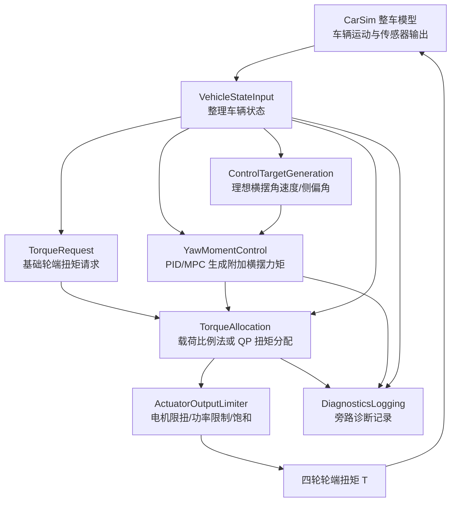
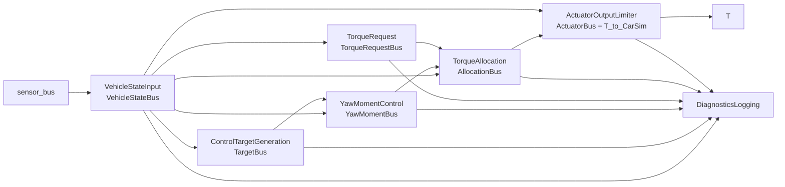
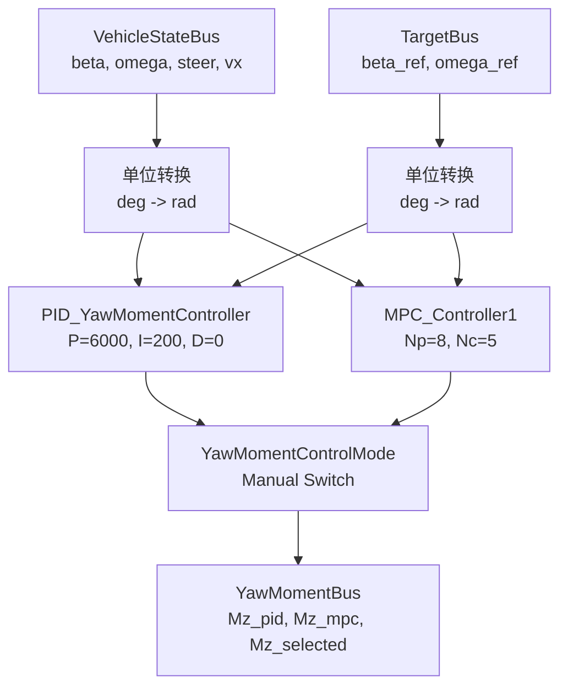
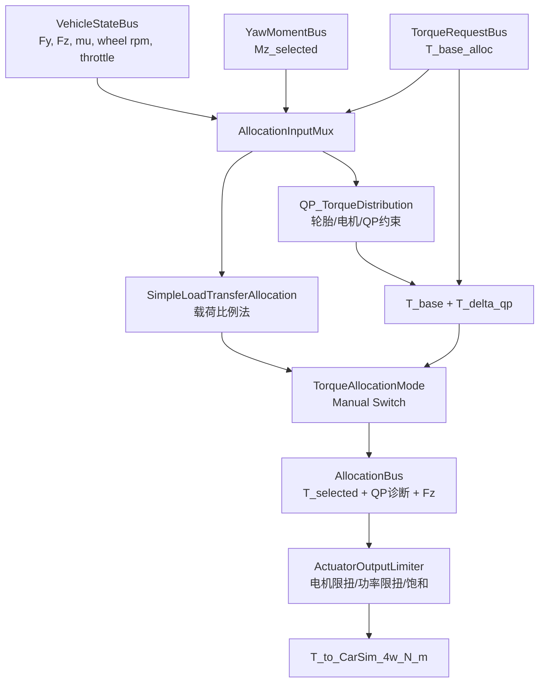

# Control_EVO 技术设计文档

这份技术设计面向项目交接和开源说明，重点回答几个问题：DYC 为什么这样设计，车辆动力学公式从哪里来，Simulink/CarSim 闭环怎么组织，以及 PID、MPC、QP、轮胎查表和电机限扭之间如何衔接。

## 1. 项目目标与整体路线

`Control_EVO` 聚焦 FSAE 电控算法验证，核心对象是直接横摆力矩控制 DYC。项目路线不是单独写一个控制器，而是把控制算法、整车模型、轮胎边界、扭矩分配和执行器限幅放在同一条闭环链路里验证。

当前设计目标可以拆成三层：

- 控制目标：根据车辆状态和目标响应生成附加横摆力矩，使车辆横摆角速度和质心侧偏角更接近期望值。
- 分配目标：把附加横摆力矩转化为四轮轮端扭矩，同时兼顾轮胎附着、电机扭矩、总驱动功率和扭矩变化率。
- 工程目标：模型结构清晰，参数来源统一，能从 CarSim + Simulink 联合仿真继续向 DLI、嵌入式和实车集成推进。

总体算法链路如下：



当前模型采用双路线控制：

- PID 是保底方案，结构直接，便于调试和上车。
- MPC 是进阶方案，用二自由度车辆模型预测未来状态，适合表达约束、响应目标和论文/答辩深度。

当前分配层也有两条路线：

- 载荷比例法用于快速、可解释的附加横摆力矩分配。
- QP 分配用于在轮胎、电机、总扭矩和变化率约束下求解更稳妥的四轮差动扭矩。

## 2. CarSim + Simulink 联合仿真架构

当前主模型为 `control_EVO/DYC_1_9_test.slx`。顶层结构是 CarSim S-Function 和 Simulink 控制系统之间的闭环：

```text
CarSim S-Function.y1 -> EVO_Control_System.sensor
EVO_Control_System.T -> CarSim S-Function.u1
```

模型静态读取可确认根层连接为：

- `CarSim S-Function`：S-Function，`FunctionName = vs_sf`。
- `EVO_Control_System`：控制系统子系统，输入 `sensor`，输出 `T`。
- `EVO_Control_System.T` 回到 `CarSim S-Function.u1`，形成四轮轮端扭矩输入闭环。

控制系统内部已经按 Bus 化数据流整理：



这套组织方式的工程意义是：

- CarSim 只负责车辆动力学和仿真环境，Simulink 控制侧只输出轮端扭矩命令。
- `VehicleStateBus` 是控制链路的状态入口，后续目标生成、横摆力矩控制、扭矩请求、分配和执行器限幅都从这里取需要的量。
- `DiagnosticsLogging` 只走旁路，不参与控制闭环，避免记录信号反向污染控制逻辑。
- 结构说明以模型静态读取结果为准，不对未运行过的长工况做额外声明。

## 3. 车辆动力学与理想响应公式

### 3.1 统一车辆参数

当前 DYC 车辆参数统一来自 `control_EVO/DYC_vehicle_params.m`，不要在各模块里分散硬编码。

| 参数 | 当前值 | 含义 |
| --- | ---: | --- |
| `r` | `0.260 m` | 车轮有效滚动半径 |
| `tf` | `1.21 m` | 前轮距 |
| `tr` | `1.20 m` | 后轮距 |
| `lf` | `0.77 m` | 质心到前轴距离 |
| `lr` | `0.77 m` | 质心到后轴距离 |
| `L` | `1.54 m` | 轴距，`L = lf + lr` |
| `m` | `300 kg` | 整车质量 |
| `Iz` | `89.99 kg*m^2` | 绕质心 z 轴横摆转动惯量 |
| `Cf` | `-43214*2 N/rad` | 前轴等效侧偏刚度 |
| `Cr` | `-43214*2 N/rad` | 后轴等效侧偏刚度 |

`Cf`、`Cr` 当前保留负号，沿用模型内侧偏角符号约定。文档和后续公式解释必须和代码的符号约定保持一致。

实现位置：`control_EVO/DYC_vehicle_params.m`，并由 `ControlTargetGeneration`、`MPC_Controller1`、`DYC_simple_load_transfer_distribution.m`、`QP_TorqueDistribution.m` 等模块调用。

### 3.2 二自由度车辆模型

当前 MPC 使用的横向二自由度模型状态为：

$$
x =
\begin{bmatrix}
\beta \\
\omega
\end{bmatrix}
$$

其中：

- `beta`：质心侧偏角，单位 rad。
- `omega`：横摆角速度，单位 rad/s。
- `delta`：前轮转角，单位 rad。
- `u`：纵向车速，单位 m/s。
- `Mz`：附加横摆力矩，单位 N*m。

连续模型写成：

$$
\dot{x} = A x + B M_z + B_d \delta
$$

当前实现中的矩阵为：

$$
A =
\begin{bmatrix}
\frac{C_f+C_r}{m u} &
\frac{C_f l_f - C_r l_r}{m u^2} - 1 \\
\frac{C_f l_f - C_r l_r}{I_z} &
\frac{l_f^2 C_f + l_r^2 C_r}{I_z u}
\end{bmatrix}
$$

$$
B =
\begin{bmatrix}
0 \\
\frac{1}{I_z}
\end{bmatrix},
\quad
B_d =
\begin{bmatrix}
-\frac{C_f}{m u} \\
-\frac{l_f C_f}{I_z}
\end{bmatrix}
$$

物理含义：

- `A` 描述车辆自身的横摆与侧偏响应。
- `B` 描述附加横摆力矩 `Mz` 对横摆角速度的作用。
- `Bd` 描述前轮转角输入对侧偏角和横摆角速度的作用。
- 当前实现对低速做保护：`u_min = 0.5`，避免 `1/u` 和 `1/u^2` 在低速或零速时造成数值问题。

实现位置：`control_EVO/DYC_1_9_test.slx` 中 `YawMomentControl/MPC_Controller1/MATLAB Function`。

### 3.3 理想横摆角速度与质心侧偏角

目标生成模块使用稳态二自由度模型计算理想横摆角速度和质心侧偏角。先定义稳定性因子：

$$
K_f = \frac{m}{L^2}\left(\frac{l_f}{C_r} - \frac{l_r}{C_f}\right)
$$

理想横摆角速度为：

$$
\omega_d =
\frac{u \delta}{L(1 + K_f u^2)}
$$

理想质心侧偏角为：

$$
\beta_d =
\left(\frac{l_r}{u^2} + \frac{m l_f}{C_r L}\right)
\frac{u^2}{L(1 + K_f u^2)}\delta
$$

当前模型输入的方向盘/前轮转角信号在目标生成中以角度传入，计算时转换为 rad；输出 `wr_d` 和 `belta_d` 又转换为 deg 进入后续 Bus。

实现位置：`control_EVO/DYC_1_9_test.slx` 中 `ControlTargetGeneration/ReferenceTargetGenerator`。

### 3.4 附着约束下的目标限制

理想目标不能无限放大。当前实现用路面附着系数 `mu` 和重力加速度 `g` 对目标值做限制：

$$
|\omega_d| \le \left|\frac{\mu g}{u}\right|
$$

$$
|\beta_d| \le
\left|
\mu g
\left(
\frac{l_r}{u^2} + \frac{m l_f}{C_r L}
\right)
\right|
$$

物理含义：

- 车速越低时，直接使用 `1/u` 会有数值风险，所以当前代码使用 `vx_safe = max(abs(vx), 0.5)`。
- 附着越低时，期望横摆响应和侧偏角目标越保守。
- 目标约束只限制控制目标，不等于轮胎真实力学极限；真实扭矩分配边界在后面的轮胎查表和 QP 中继续处理。

实现位置：`ControlTargetGeneration/ReferenceTargetGenerator`。

## 4. 横摆力矩控制：PID 与 MPC

横摆力矩控制模块接收 `VehicleStateBus` 和 `TargetBus`，输出 `YawMomentBus`。当前 Bus 中包含 PID 候选、MPC 候选和最终选择的 `Mz_selected_N_m`。

控制链路如下：



### 4.1 PID 横摆角速度误差控制

PID 分支以目标横摆角速度和实际横摆角速度之间的误差为核心，当前参数为：

$$
M_{z,pid} = K_p e_\omega + K_i \int e_\omega dt + K_d \frac{d e_\omega}{dt}
$$

其中当前模型参数为：

$$
K_p = 6000,\quad K_i = 200,\quad K_d = 0
$$

工程含义：

- PID 结构清晰，适合作为保底控制。
- 当前重点跟踪横摆角速度，便于调参和解释。
- PID 输出作为 `Mz_pid_N_m` 进入 `YawMomentBus`，再由手动开关选择是否作为最终附加横摆力矩。

实现位置：`DYC_1_9_test.slx` 中 `YawMomentControl/PID_YawMomentController`。

### 4.2 MPC 预测模型

MPC 分支使用上文的二自由度模型，并用一阶欧拉离散化：

$$
G = I + T A
$$

$$
H_d = T B,\quad B_d^d = T B_d
$$

为了让优化量表达为附加横摆力矩增量，同时输出绝对附加横摆力矩，当前模型构造增广状态：

$$
\xi =
\begin{bmatrix}
\beta \\
\omega \\
M_z(k-1)
\end{bmatrix}
$$

增广系统为：

$$
\xi(k+1) =
\bar{A}\xi(k) + \bar{B}\Delta M_z(k) + \bar{B}_d\delta(k)
$$

其中：

$$
\bar{A} =
\begin{bmatrix}
G & H_d \\
\mathbf{0}_{1\times2} & 1
\end{bmatrix},
\quad
\bar{B} =
\begin{bmatrix}
H_d \\
1
\end{bmatrix},
\quad
\bar{C} =
\begin{bmatrix}
I_2 & 0
\end{bmatrix}
$$

当前参数：

- 预测时域 `Np = 8`。
- 控制时域 `Nc = 5`。
- 采样周期 `T = 0.0005 s`。
- 输出权重 `Qi = diag(0, 10)`，当前更重视横摆角速度跟踪。
- 控制增量权重 `R = 0.0003 I`。
- 输出限幅 `Mz in [-1000, 1000] N*m`。

实现位置：`YawMomentControl/MPC_Controller1/MATLAB Function`。

### 4.3 MPC 代价函数

预测输出可以写成：

$$
Y = S_c \xi + S_d \delta + S_u \Delta U
$$

目标序列为：

$$
Y_{ref} =
\begin{bmatrix}
\beta_{ref} \\
\omega_{ref} \\
\vdots
\end{bmatrix}
$$

误差为：

$$
E = S_c \xi + S_d \delta - Y_{ref}
$$

当前二次型目标为：

$$
J =
(E + S_u\Delta U)^T Q (E + S_u\Delta U)
+ \Delta U^T R \Delta U
$$

对应的无约束二次规划正规形式为：

$$
H_{qp} = 2(S_u^T Q S_u + R)
$$

$$
G_{qp} = 2E^T Q S_u
$$

当前代码用：

$$
\Delta U = -H_{qp}^{-1}G_{qp}^T
$$

但实现上不是显式 `inv(H)`，而是使用反斜杠求解，并加入：

$$
H_{qp} = H_{qp} + 10^{-9}I
$$

以改善病态矩阵下的数值稳定性。

实现位置：`YawMomentControl/MPC_Controller1/MATLAB Function`。

## 5. 基础扭矩请求与制动平滑

基础扭矩请求由 `TorqueRequest` 子系统生成，核心 MATLAB 函数是：

- `control_EVO/DYC_base_motor_torque.m`
- `control_EVO/DYC_torque_request_manager.m`

### 5.1 油门到基础轮端扭矩

基础轮端扭矩只表达驾驶员扭矩意图，不在这里做轮速外特性限扭或总功率限扭。

当前计算为：

$$
T_{base,per\ wheel}
= throttle \cdot T_{motor,max} \cdot i_g \cdot \eta
$$

当前参数为：

$$
T_{motor,max}=21 N*m,\quad i_g=11,\quad \eta=0.99
$$

输出四轮相同：

$$
T_{base} =
\begin{bmatrix}
T_{base,per\ wheel} \\
T_{base,per\ wheel} \\
T_{base,per\ wheel} \\
T_{base,per\ wheel}
\end{bmatrix}
$$

实现位置：`control_EVO/DYC_base_motor_torque.m`。

### 5.2 制动状态下的驱动使能平滑

制动状态通过 `driveEnableState` 平滑地作用到分配层基础扭矩上：

$$
targetEnable = 1 - brakeCmd
$$

上升和下降限速为：

$$
\Delta enable_{rise,max}=5T_s
$$

$$
\Delta enable_{fall,max}=20T_s
$$

其中：

$$
T_s = 0.0005 s
$$

最终进入分配层的基础扭矩为：

$$
T_{base,alloc} = T_{base,raw}\cdot driveEnableState
$$

工程意义：

- 制动时基础驱动扭矩不会突变。
- 原始油门需求和进入分配层的基础扭矩分开保留，便于诊断。
- 最终电机限扭和功率限扭仍在执行器输出层统一处理。

实现位置：`control_EVO/DYC_torque_request_manager.m`。

## 6. 扭矩分配：载荷比例法与 QP

`TorqueAllocation` 子系统接收 `VehicleStateBus`、`YawMomentBus` 和 `TorqueRequestBus`，输出 `AllocationBus`。当前有两种候选分配方式，并通过 `TorqueAllocationMode` 手动开关选择：

- `SimpleLoadTransferAllocation`：载荷比例法。
- `QP_TorqueDistribution`：二次规划差动扭矩分配。

分配与执行器限幅链如下：



### 6.1 差动扭矩产生附加横摆力矩

四轮差动扭矩与附加横摆力矩之间的关系由轮距和车轮半径决定。当前 QP 中使用：

$$
M_z =
\begin{bmatrix}
-\frac{t_f}{2r} &
\frac{t_f}{2r} &
-\frac{t_r}{2r} &
\frac{t_r}{2r}
\end{bmatrix}
\Delta T
$$

其中：

$$
\Delta T =
\begin{bmatrix}
\Delta T_{L1}\\
\Delta T_{R1}\\
\Delta T_{L2}\\
\Delta T_{R2}
\end{bmatrix}
$$

工程含义：

- 左右轮扭矩差通过轮距产生横摆力矩。
- 前后轴使用不同轮距 `tf`、`tr`。
- 车轮半径 `r` 用于轮端扭矩和地面纵向力之间换算。

实现位置：`control_EVO/QP_TorqueDistribution.m` 中 `yawArm = [-tf/2/r, tf/2/r, -tr/2/r, tr/2/r]`。

### 6.2 载荷比例法

载荷比例法先按各轮垂向载荷把目标附加横摆力矩拆分到四个轮：

$$
M_{z,i} = \frac{F_{z,i}}{\sum F_z}M_z
$$

再换算成四轮差动扭矩：

$$
\Delta T_{L1} = -\frac{2M_{z,L1}r}{t_f}
$$

$$
\Delta T_{R1} = \frac{2M_{z,R1}r}{t_f}
$$

$$
\Delta T_{L2} = -\frac{2M_{z,L2}r}{t_r}
$$

$$
\Delta T_{R2} = \frac{2M_{z,R2}r}{t_r}
$$

最终输出：

$$
T_{cmd} = T_{base} + \Delta T
$$

工程含义：

- 垂向载荷大的轮分到更多横摆力矩任务。
- 算法可解释、实现简单，适合作为分配层基线。
- 如果某个轮载荷无效或小于等于 0，对应差动扭矩置 0。

实现位置：`control_EVO/DYC_simple_load_transfer_distribution.m`，以及 `TorqueAllocation/SimpleLoadTransferAllocation`。

### 6.3 QP 扭矩分配

QP 分支只分配 DYC 差动扭矩，最终四轮命令由基础扭矩叠加差动扭矩得到：

$$
T_{candidate} = T_{base} + \Delta T
$$

当前优化变量为：

$$
X =
\begin{bmatrix}
\Delta T_{L1}\\
\Delta T_{R1}\\
\Delta T_{L2}\\
\Delta T_{R2}\\
s_{yaw}
\end{bmatrix}
$$

其中 `s_yaw` 是横摆力矩松弛项。等式约束为：

$$
yawArm\cdot \Delta T + s_{yaw} = M_z
$$

不等式约束用于限制 DYC 对总驱动扭矩的改变：

$$
\sum \Delta T_i \le totalAddLimit
$$

$$
-\sum \Delta T_i \le totalCutLimit
$$

当前总加扭和减扭限制为：

$$
totalCutLimit = \min(160,\ 0.25\sum \max(T_{base}, 0) + 20)
$$

$$
totalAddLimit = \min(80,\ 0.10\sum \max(T_{base}, 0))
$$

工程含义：

- DYC 可以在极限工况下小幅改变总驱动扭矩。
- 减扭能力比加扭能力更大，符合稳定性控制通常优先减扭的工程思路。
- `totalDeltaWeight = 1e-2` 进一步鼓励 QP 不随意改变总驱动扭矩。

实现位置：`control_EVO/QP_TorqueDistribution.m`。

### 6.4 QP 边界与平滑约束

QP 的四轮差动扭矩边界来自最终扭矩物理边界：

$$
\Delta T_{lb} = T_{physical,lb} - T_{base}
$$

$$
\Delta T_{ub} = T_{physical,ub} - T_{base}
$$

同时加入差动扭矩变化率限制：

$$
|\Delta T(k) - \Delta T(k-1)| \le 1500T_s
$$

其中：

$$
T_s = 0.0005 s
$$

当前代价函数由三部分组成：

- 轮胎余量权重：余量越小，使用该轮差动扭矩越贵。
- 横摆松弛权重：`yawSlackWeight = 1e3`，尽量满足目标 `Mz`。
- 连续性权重：`deltaContinuityWeight = 2e-3`，抑制相邻采样跳变。

求解器使用：

```matlab
quadprog(H, f, A, b, Aeq, beq, lb, ub, x0, options)
```

如果 `quadprog` 失败或输出非法，当前回退为零差动扭矩，并输出诊断量。

实现位置：`control_EVO/QP_TorqueDistribution.m`。

## 7. 轮胎模型与 Pacejka/Hoosier 控制查表

当前控制器的轮胎路径是“控制查表边界”，不是把完整 Pacejka 轮胎模型直接塞进实时控制器。核心接口是：

- `control_EVO/DYC_tire_lookup_config.m`
- `control_EVO/tire_modeling/lookup_tire_control_limits.m`
- `control_EVO/tire_modeling/outputs/pacejka_control_lookup_model.mat`
- `control_EVO/tire_modeling/outputs/hoosier43075_control_model.mat`

当前默认配置为：

```matlab
cfg.mode = 'pacejka';
cfg.modelFile = '';
cfg.allowEnvironmentOverride = false;
```

工程含义：

- 当前主线使用由 Round 9 Pacejka 工程模型扫描生成的控制查表。
- `allowEnvironmentOverride = false`，说明控制器只听代码配置，不允许环境变量临时覆盖模型来源。
- Hoosier 43075 查表仍保留，可通过代码配置切换。

### 7.1 Hoosier 控制查表

Hoosier 路径用于把 TTC Round9 数据整理成 DYC/TC 可用的低阶控制边界：

- 横向轮胎：Hoosier 43075 16x7.5-10 R20，7 inch rim，12 psi。
- 横向数据：`RunData_Cornering_Matlab_SI_Round9` runs `2,4,5,6`。
- 纵向代理：Hoosier 43100 18.0x6.0-10 R20，7 inch rim，12 psi。
- 纵向数据：`RunData_DriveBrake_Matlab_SI_Round9` runs `71,72,73`。
- 纵向保守缩放：`muScaleTc = 0.70`。
- 控制封顶：`controlMuCeiling = 1.00`。

必须明确：Hoosier 43075 当前没有完整纵向 drive/brake 数据，纵向路径使用 43100 代理，并且是控制边界模型，不是完整 combined-slip 物理辨识模型。

实现位置：`control_EVO/tire_modeling/README.md`、`lookup_hoosier43075_limits.m` 和 `lookup_tire_control_limits.m`。

### 7.2 Pacejka 生成控制查表

Pacejka 路径来自 `control_EVO/round9_pacejka_engineering_package/` 的工程模型，再扫描生成控制用查表：

- 横向来源：`Hoosier16_0X7_5_10R20_C2000_rim7in`。
- 纵向来源：`Hoosier18_0X6_0_10R20_rim7in`。
- 输出模型：`control_EVO/tire_modeling/outputs/pacejka_control_lookup_model.mat`。
- 控制封顶：`controlMuCeiling = 1.00`。
- 纵向保守缩放：`muScaleTc = 0.70`。

Pacejka 查表输出包括：

- `mu_y`：横向附着系数边界。
- `mu_x`：纵向附着系数边界。
- `C_alpha`：侧偏刚度估计。
- `C_kappa`：纵向滑移刚度估计。
- `Fx_limit`：当前横向力占用后的纵向力边界。
- `T_limit`：换算到轮端扭矩的控制边界。

实现位置：`control_EVO/tire_modeling/outputs/pacejka_control_lookup_report.md` 和 `lookup_tire_control_limits.m`。

### 7.3 摩擦圆/摩擦椭圆边界

在 QP 中，即使查表可用，也会和路面 `Mu` 摩擦圆边界叠加。当前回退摩擦圆扭矩边界为：

$$
T_{road,limit}
= r\sqrt{\max((\mu F_z)^2 - F_y^2,\ 0)}
$$

查表接口内部使用类似摩擦椭圆的横纵向占用逻辑：

$$
F_{y,limit} = \mu_y F_z
$$

$$
F_{x,peak} = \mu_x F_z
$$

$$
usage_y = \frac{|F_y|}{F_{y,limit}}
$$

$$
F_{x,limit}
= F_{x,peak}\sqrt{\max(1 - usage_y^2,\ 0)}
$$

$$
T_{limit} = \min(F_{x,limit}r,\ T_{motor,limit})
$$

QP 最终取多类限制中的最小值：

$$
T_{limit}
= \min(T_{lookup}, T_{road}, T_{motor}, T_{peak})
$$

工程含义：

- 查表给出轮胎数据驱动的控制边界。
- `Mu` 摩擦圆是保守回退和路面约束。
- 电机峰值和外特性限制仍然参与最终边界。
- 查表不可用时，QP 会回退到 `Mu` 摩擦圆，不会直接失效。

实现位置：`control_EVO/QP_TorqueDistribution.m` 和 `control_EVO/tire_modeling/lookup_tire_control_limits.m`。

## 8. 电机限扭、功率限制与最终输出

最终输出层为 `ActuatorOutputLimiter`。它接收 `AllocationBus` 中选择出的四轮扭矩，结合 `VehicleStateBus` 中的油门和轮速，统一执行：

- 电机转速外特性限扭。
- 整车总正驱动功率限制。
- 四轮轮端扭矩饱和。
- 输出到 CarSim 的四轮轮端扭矩 `T_to_CarSim_4w_N_m`。

### 8.1 电机转速限扭

当前先把轮速换算为电机转速：

$$
n_{motor} = |n_{wheel}| i_g
$$

其中：

$$
i_g = 11
$$

再通过表格插值得到电机扭矩上限：

$$
T_{wheel,limit} = T_{motor,limit}(n_{motor}) i_g \eta
$$

其中：

$$
\eta = 0.99
$$

实现位置：`control_EVO/DYC_motor_wheel_torque_limit.m`。

### 8.2 总正驱动功率限扭

执行器层会计算当前正驱动功率需求：

$$
P_{request} =
\sum_i \max(T_i,0)\omega_i
$$

可用驱动功率为：

$$
P_{available} = throttle \cdot 78kW
$$

如果：

$$
P_{request} > P_{available}
$$

则对所有正扭矩按比例缩放：

$$
scale = \frac{P_{available}}{P_{request}}
$$

负扭矩不按这个正驱动功率比例缩放。

实现位置：`control_EVO/DYC_apply_motor_limits.m`。

### 8.3 最终饱和与 CarSim 输入

`ActuatorOutputLimiter` 在 `DYC_apply_motor_limits` 后还经过 `WheelTorqueSaturation`：

$$
T_{cmd,out} = clamp(T_{limited}, -400,\ 400)
$$

随后 `DrivelineGain` 当前为 `1`，直接输出到：

```text
T_to_CarSim_4w_N_m
```

工程含义：

- 分配层可以产生候选四轮扭矩。
- 执行器层统一处理电机和功率边界。
- 最后输出给 CarSim 的是已经限幅后的四轮轮端扭矩，而不是未处理的控制器内部变量。

实现位置：`DYC_1_9_test.slx` 中 `ActuatorOutputLimiter`，以及 `DYC_apply_motor_limits.m`、`DYC_motor_wheel_torque_limit.m`。

## 9. 当前验证边界与后续开发建议

### 9.1 当前已确认边界

本说明基于以下事实：

- Simulink MCP 可以读取 `control_EVO/DYC_1_9_test.slx`，并确认顶层 `CarSim S-Function` 使用 `vs_sf`。
- 静态模型结构为 `CarSim S-Function -> EVO_Control_System -> T` 闭环。
- `EVO_Control_System` 内部主数据流为 `VehicleStateBus -> TargetBus -> YawMomentBus -> TorqueRequestBus / AllocationBus -> ActuatorBus`。
- 车辆参数统一来自 `DYC_vehicle_params.m`。
- 当前轮胎控制查表默认使用 `pacejka`，不允许环境变量覆盖。
- 当前基础仿真未发现明显问题，项目内已确认这一点。

这里不新增以下结论：

- 没有新增长工况 CarSim 仿真结论。
- 没有新增 DLI 实时仿真结论。
- 没有新增实车验证结论。
- 没有声明比赛级参数已经定版。

### 9.2 后续开发建议

后续继续开发时，建议按以下顺序推进：

1. 保持车辆参数单一来源
   所有理想响应、MPC、载荷转移、QP 和轮胎边界都应继续调用 `DYC_vehicle_params.m`，避免参数漂移。

2. 明确当前开关选择
   `YawMomentControl` 和 `TorqueAllocation` 都存在 Manual Switch。每次评估结果时，需要说明当前选择的是 PID/MPC，以及载荷比例法/QP。

3. 把轮胎查表当作控制边界
   当前 Pacejka/Hoosier 输出主要服务于控制限幅。不要把它直接等同于 CarSim 内部轮胎模型，也不要把它当作最终实车轮胎模型。

4. 补足工况验证记录
   建议为典型工况保存表格化记录：模型版本、开关选择、停止时间、关键输出、警告、LastRun 文件状态和是否可复现。

5. 为嵌入式迁移保留接口意识
   当前 Simulink 模型使用 Bus 化结构，后续转 C 或接入主程序时，应保留“状态输入 - 目标生成 - 横摆力矩 - 扭矩请求 - 扭矩分配 - 执行器限幅”的边界。

6. DLI 和实车阶段重新收敛传感器输入
   控制器输入不能只按 CarSim 能输出什么设计，必须回到实车真实可用信号，尤其是车速、横摆角速度、加速度、方向盘/前轮转角、轮速、油门和制动状态。

### 9.3 交接阅读顺序

建议新成员按以下顺序读项目：

1. 本技术设计文档：先理解完整算法架构和公式。
2. `DYC_设计流程说明.md`：理解项目路线、PID/MPC 策略和后续落地思路。
3. `control_EVO/DYC_vehicle_params.m`：确认统一车辆参数。
4. `control_EVO/DYC_1_9_test.slx`：查看 Simulink 主模型和 Bus 化结构。
5. `control_EVO/QP_TorqueDistribution.m`：理解 QP 扭矩分配。
6. `control_EVO/tire_modeling/README.md`：理解轮胎查表来源和使用边界。
7. `control_EVO/round9_pacejka_engineering_package/docs/pacejka_round9_usage.md`：理解 Pacejka 工程模型的来源、能力和限制。
